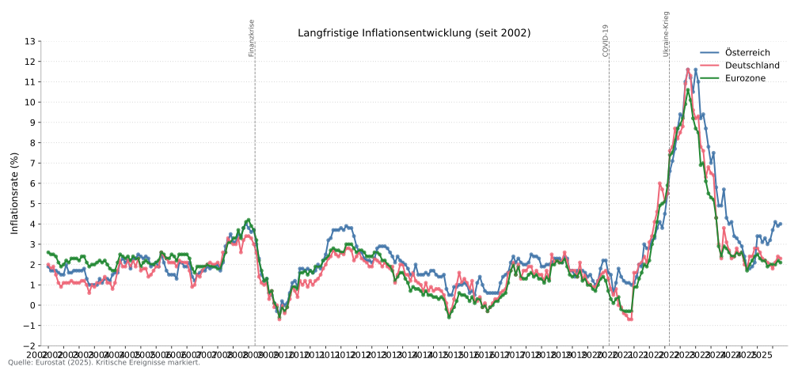

# Inflationsbericht Österreich   

Ein Werkzeug zur Analyse und Visualisierung von Inflationsdaten für Österreich im Vergleich zu Deutschland und dem Euroraum. Es generiert reproduzierbare SVG-Grafiken und bietet optional ein FastAPI-Backend plus Streamlit-Dashboard.

## Übersicht
- Automatisierter Workflow für Eurostat-HICP-Daten, Zinsreihen (EZB, optional FED) und eigene Konfigurationen.
- Fokus auf hochwertige SVG-Ausgaben, die direkt in Präsentationen/Berichten genutzt werden können.
- Optionales API + Dashboard für interaktive Exploration (Länderwahl, Zeiträume, Komponenten, Zinsen).

## Funktionen
### Daten & Analyse
- **Datenquelle**: Eurostat HICP (`prc_hicp_manr`), EZB-Leitzinsen (`irt_st_m`), optional FRED Fed Funds (`DFF`).
- **Regionen**: Österreich, Deutschland, Eurozone (EA20); Komponenten (CP00, FOOD, NRG, IGD, SERV).
- **Zeitraum**: ab 2002 (Inflation) bzw. 2000 (Zinsen); Konfiguration via `config.yaml`.
- **Analyse**: Statistiken, Trendindikatoren, Differenz AT vs. Eurozone, Länder-Vergleiche.

### Prognose
- Holt-Winters (gedämpfter Trend) als Primärmodell; Fallback: lineare Regression, falls Daten nicht ausreichen.
- Trainingszeitraum: letzte 24 Monate; 95%-Prädiktionsintervalle.

### Visualisierungen (SVG)
1. `inflation_comparison.svg`: Vergleich + Prognose.
2. `ecb_interest_rates.svg`: EZB-Leitzinsen seit 2000.
3. `inflation_difference.svg`: Inflationsdifferenz AT vs. Eurozone.
4. `statistics_comparison.svg`: zentrale Kennzahlen.
5. `historical_comparison.svg`: Langfristige Entwicklung mit Events.
6. `eu_inflation_heatmap.svg`: Heatmap der Inflationsraten in der EU.

### API & Dashboard
- Endpoints: `/health`, `/config`, `/data` (Cache), `/refresh` (Recompute mit Payload).
- Streamlit-Dashboard: Länder- und Zeitraumwahl, Komponenten-Chart pro Land, KPI-Kacheln, Zinschart (EZB + FED), optional eigene API-URL.

### Output
- SVG-Dateien landen in `output/`.
- Vorschaubilder in `docs/previews/` (manuell aktualisieren nach einem Lauf).

### Vorschau (Beispiele)
> Hinweis: Vorschaubilder liegen in `docs/previews/` und sollten nach `make figures` bei Bedarf kopiert/aktualisiert werden.

| Plot | Vorschau |
| --- | --- |
| Inflation Comparison |  |
| ECB Interest Rates |  |
| Inflation Difference |  |
| Statistics Comparison |  |
| Historical Comparison |  |
| EU Inflation Heatmap |  |

## Erste Schritte
### Voraussetzungen
- Python 3.8 oder höher (empfohlen: 3.11+).

### Installation
1) Repository klonen:
```bash
git clone https://github.com/jstreitberger03/inflation-report-austria.git
cd inflation-report-austria
```
2) Virtuelle Umgebung erstellen und aktivieren:
- Windows:
```bash
python -m venv .venv
.venv\Scripts\activate
```
- macOS/Linux:
```bash
python -m venv .venv
source .venv/bin/activate
```
3) Abhängigkeiten installieren (inkl. `python-plot-template` aus Git):
```bash
pip install -r requirements.txt
pip install -e .
```
Falls das Template-Repo lokal neben diesem Projekt liegt, können Sie es alternativ so einbinden:
```bash
pip install -e ../python-plot-template
```

## Grafiken erzeugen
Erzeugen der SVGs:
```bash
make figures
```
Ausgabe: `output/*.svg` (im Git ignoriert).

Aufräumen:
```bash
make clean
```

## Dashboard + API
### Backend starten (FastAPI)
```bash
uvicorn backend.app:app --reload --port 8000
```
Endpoints:
- `GET /health` – Health Check
- `GET /config` – aktuelle Konfiguration
- `GET /data` – vorberechnete Daten (Inflation, Vergleich, Zinsen)
- `POST /refresh` – Daten neu berechnen (optional mit Länder-/Zeitraum-Payload)

### Dashboard starten (Streamlit)
```bash
streamlit run frontend/streamlit_app.py
```
Im Sidebar können Sie Länder wählen, Zeitraum setzen und die API-URL anpassen (Standard: `http://127.0.0.1:8000`).

## Projektstruktur
```
inflation-report-austria/
├── backend/                 # FastAPI Backend
├── frontend/                # Streamlit Dashboard
├── inflation_report/        # Daten, Analyse, Prognose, Visualisierung, Reporting
├── docs/previews/           # Beispiel-SVGs
├── output/                  # Generierte SVGs (ignored)
├── Makefile                 # Targets für figures/clean
├── main.py                  # Pipeline-Entrypoint
├── config.yaml              # Konfiguration (optional)
├── pyproject.toml           # Projektmetadaten
├── requirements.txt         # Python-Abhängigkeiten
└── README.md
```

## Datenbasis
- **Anbieter**: Eurostat; **Datensätze**: `prc_hicp_manr` (Inflation), `irt_st_m` (EZB-Leitzinsen), optional FRED `DFF`.
- **Regionen**: Österreich (AT), Deutschland (DE), Eurozone (EA20) + Komponenten.
- **Zeitraum**: ab 2002 (Inflation) bzw. 2000 (Zinsen).

## Technologie-Stack

| Komponente         | Technologie                                      |
|--------------------|--------------------------------------------------|
| Daten/Config       | pandas, numpy, eurostat, PyYAML, pycountry       |
| Statistik/ML       | statsmodels, scikit-learn                        |
| Visualisierung     | Matplotlib, python-plot-template, Plotly         |
| API/Backend        | FastAPI, Pydantic, Uvicorn, Requests             |
| Dashboard          | Streamlit, Plotly                                |

## Lizenz
Dieses Projekt ist unter der MIT-Lizenz lizenziert (siehe `LICENSE`).
